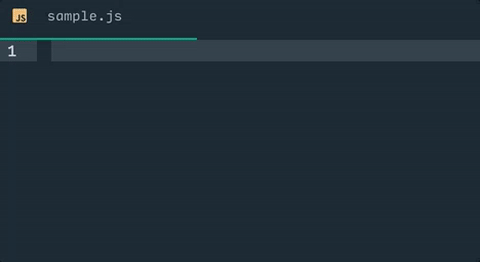

# bracket-padder for Atom

A simple package that provides smart padding and closing of bracket pairs: `()` `[]` `{}`

## Examples
The `|` character represents cursor position.

### Auto padding
`(|)` + <kbd>Space</kbd> results in `( | )` instead of `( |)`.

### Auto closing
`( | )` + <kbd>)</kbd> results in `(  )|` instead of `( )| )`.
